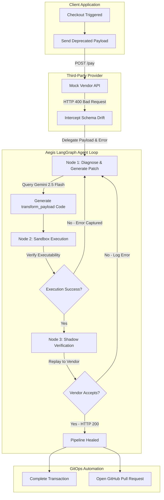

# Aegis: Autonomous API Remediation Middleware

Aegis is a self-healing API integration middleware designed to resolve runtime schema drift and HTTP 400 Bad Request errors dynamically. It intercepts failing outbound API calls, routes them through a LangGraph agent that diagnoses the drift, generates a Python mapping patch using Gemini, verifies it in an execution sandbox, replays the corrected request, and submits an automated Pull Request to push the fix back to the codebase.

## System Architecture

Aegis consists of three primary components:
1. **Mock Vendor API (`mock_vendor.py`)**: Simulates a third-party service that requires a nested `transaction` schema.
2. **Product Backend (`product_backend.py`)**: Simulates the client application. It intercepts HTTP 400 errors and routes them to the Aegis Agent instead of crashing.
3. **Aegis Agent (`aegis_agent.py` & `server.py`)**: A LangGraph state machine orchestrating diagnosis, sandbox execution, shadow verification, and telemetry streaming via a React control plane dashboard.

## Workflow Diagram



## Repository Structure

```
├── backend/
│   ├── aegis_agent.py     # LangGraph agent definition and nodes
│   ├── server.py          # FastAPI dashboard server and SSE telemetry stream
│   ├── dashboard.html     # React control plane frontend dashboard
│   ├── product_backend.py # Client application checkout simulator
│   ├── mock_vendor.py     # Third-party mock API service
│   ├── test_llm.py        # Gemini API validation script
│   └── .env               # Environment secrets (ignored by Git)
├── .gitignore             # Root git ignore file
├── requirements.txt       # Project dependency manifest
└── README.md              # Project documentation
```

## Setup Instructions

Follow these steps to set up and run Aegis locally.

### 1. Prerequisites
- Python 3.9 or higher
- Git

### 2. Environment Setup
Clone the repository and navigate to the project root directory:
```bash
git clone <repository-url>
cd AutoHeal.ai
```

Create a virtual environment and activate it:
- On Windows:
  ```powershell
  python -m venv venv
  .\venv\Scripts\activate
  ```
- On macOS/Linux:
  ```bash
  python3 -m venv venv
  source venv/bin/activate
  ```

Install the dependencies:
```bash
pip install -r requirements.txt
```

### 3. Configuration
Create a `.env` file inside the `backend/` directory:
```
backend/.env
```

Add the following environment variables:
```env
GEMINI_API_KEY="your-gemini-api-key"
GITHUB_TOKEN="your-github-personal-access-token"
GITHUB_REPO_NAME="your-github-username/your-repo-name"
```
*Note: GITHUB_TOKEN is only required for the optional GitOps automated PR creation.*

---

## Running the Middleware

Follow these steps to run the simulation and observe the self-healing telemetry.

### Step 1: Start the Mock Vendor API
Run the mock payment processor in your terminal. It runs on port 8001:
```bash
python backend/mock_vendor.py
```

### Step 2: Start the Control Plane Server
In a new terminal, run the FastAPI telemetry dashboard. It runs on port 8000:
```bash
python backend/server.py
```

### Step 3: Open the Dashboard
Open your web browser and navigate to:
```
http://127.0.0.1:8000/
```

### Step 4: Run Checkout Simulation
1. Click the **Checkout & Pay** button on the Consumer App Simulator.
2. The dashboard logs will update in real-time, showing:
   - The initial HTTP 400 Bad Request error.
   - The LangGraph agent starting, running the `diagnose` node, and calling the LLM.
   - The sandbox execution output showing the corrected payload.
   - The verification step successfully replaying the healed request to the mock vendor API.
3. Review the generated python patch in the Code Diff Viewer.
4. Click **Approve & Merge PR** to push the patch directly to your GitHub repository.
