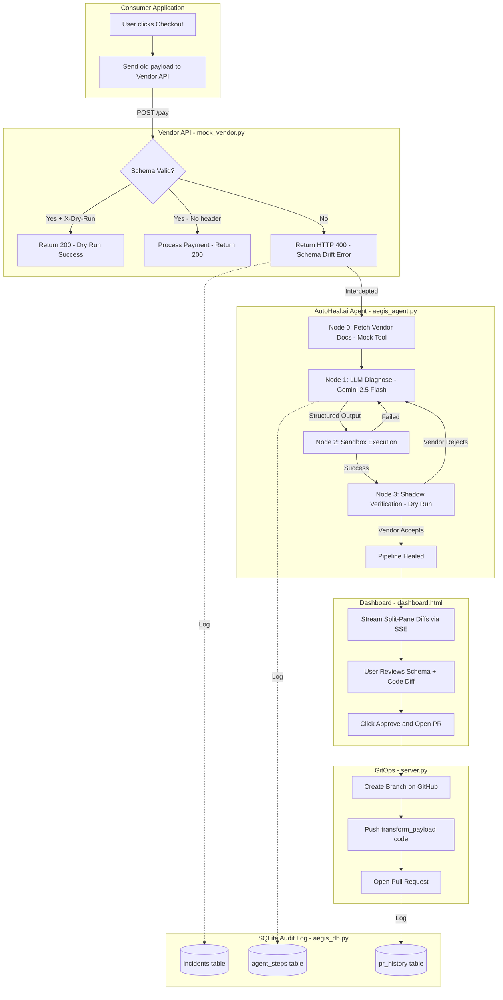

# AutoHeal.ai v2 - Walkthrough & Explainer

## What Was Built

AutoHeal.ai is an autonomous API remediation middleware that self-heals failing API integrations at runtime. When a third-party API changes its schema overnight (schema drift), AutoHeal.ai intercepts the HTTP 400 error, uses a LangGraph agent powered by Gemini to generate a Python patch, tests it in a sandbox, verifies it via dry-run, and opens a GitHub Pull Request -- all with zero downtime.

---

## Architecture Flow



---

## Files Changed

### 1. `aegis_db.py` [NEW]
**What:** SQLite audit log module with 3 tables.
**Why:** Provides a persistent local record of every failure, every agent remediation attempt, and every PR created.

| Table | Purpose |
|-------|---------|
| `incidents` | Tracks each API failure event (payload, error, status) |
| `agent_steps` | Logs each LangGraph node execution (reasoning, schemas, code, verification result) |
| `pr_history` | Records every GitHub PR created (branch, target file, URL, status) |

---

### 2. `aegis_agent.py` [REFACTORED]
**What changed:**

| Feature | Before (v1) | After (v2) |
|---------|-------------|------------|
| LLM Output | `reasoning` + `python_code` | `reasoning` + `old_schema` + `new_schema` + `old_code` + `new_code` |
| Tool Integration | None | `fetch_vendor_documentation` mock tool returns OpenAPI snippet |
| Shadow Verification | Live POST (unsafe) | Dry-run with `X-Dry-Run` + `Idempotency-Key` headers |
| PR Targeting | Hardcoded file path | Stack trace introspection via `traceback.extract_stack()` |
| Audit Logging | None | Every node logs to SQLite via `aegis_db` |
| Graph Nodes | 3 nodes (diagnose, sandbox, verify) | 4 nodes (fetch_docs, diagnose, sandbox, verify) |

**How the Enhanced Structured Output works:**
The `AgentPatchResponse` Pydantic model forces Gemini to return 5 fields. LangChain's `.with_structured_output()` ensures the LLM returns valid JSON matching the schema. This is what enables the split-pane diff UI.

**How Stack Trace Introspection works:**
`introspect_caller_file()` walks the Python call stack using `traceback.extract_stack()`, skips framework files, and returns the source file that initiated the API call. This path is passed through the LangGraph state to the PR endpoint.

---

### 3. `mock_vendor.py` [UPDATED]
**What changed:** Added dry-run support.
- Checks for `X-Dry-Run: true` header
- If present and schema is valid: returns `200 OK` with `dry_run_success` (no payment processed)
- If absent and schema is valid: processes the payment normally
- If schema is invalid: returns `400 Bad Request` regardless of dry-run

---

### 4. `server.py` [REFACTORED]
**What changed:**

| Feature | Before | After |
|---------|--------|-------|
| SSE Data | Only `code` and `healed_payload` | Also streams `old_schema`, `new_schema`, `old_code`, `new_code`, `source_file` |
| PR Endpoint | Hardcoded `stripe_integration.py` | Accepts dynamic `source_file` from frontend |
| PR Response | Tuple return (broken) | Proper `JSONResponse` with status codes |
| Audit Logging | None | Creates incidents, logs PRs to SQLite |
| New Endpoints | None | `GET /api/incidents` and `GET /api/incidents/{id}` |

---

### 5. `dashboard.html` [REWRITTEN]
**What changed:**

| Feature | Before | After |
|---------|--------|-------|
| Code Display | Single code block showing new code only | Split-pane comparison with tabs |
| Schema View | None | Schema Diff tab: old vs new JSON side-by-side |
| Code View | Single pane | Code Diff tab: `format_payload` vs `transform_payload` side-by-side |
| PR Button | Sends only `code` | Sends `new_code` + `source_file` for dynamic targeting |
| Incident History | None | Collapsible sidebar showing incident log from SQLite |
| Branding | Aegis | AutoHeal.ai |

---

## How to Restart and Test

1. Stop both running terminal processes (`Ctrl+C` in each terminal)

2. Start the mock vendor:
   ```bash
   python backend/mock_vendor.py
   ```

3. Start the dashboard server:
   ```bash
   python backend/server.py
   ```

4. Open `http://127.0.0.1:8003/` and click **Checkout & Pay**

5. Watch the terminal and dashboard for:
   - Node 0: Vendor docs fetched
   - Node 1: LLM generates structured output with schemas + code
   - Node 2: Sandbox executes the transform function
   - Node 3: Dry-run verification accepted
   - Dashboard shows split-pane Schema Diff and Code Diff
   - Click "Show Incident Log" to see audit history

6. Click **Approve & Open PR** to push to GitHub
